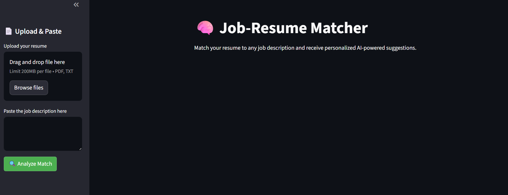

# 🧠Job-Resume Matcher

An intelligent web app that compares your resume to any job description using AI, calculates a match score, and suggests resume improvements — all in real-time.

## 🔗 Live Demo

https://resume-matcherr.streamlit.app/

## 🚀 Features

- 📄 Upload your resume (PDF or TXT)
- 💼 Paste any job description
- 🤖 AI-generated match score (semantic similarity)
- 🧠 GPT-powered suggestions to improve your resume
- ⚙️ Built with LangChain, OpenAI, Streamlit, and FAISS

## 📸 Screenshots

## 🙋‍♂️ Author

**Kishore Kumar Avudai Nayagam**  
Graduate Student, University at Buffalo  
[LinkedIn](#) | [Portfolio](#) | [Email](#)
